---
{"dg-publish":true,"permalink":"/20-work-spaces/computer-science/programming/scheme/htdp/1-how-to-code-simple-data/module-1/2-how-to-design-functions/"}
---


up:: 
tags:: 


# How to Design Functions 

## Learning Goals
- Be able to [[20-workSPACES/Computer Science/Programming/Scheme/HTDP/Recipes/Core Recipes/HtDF\|How to Design Functions (HtDF) recipe]] to design functions that operate on primitive data. 
- Be able to read a complete function design and identify its different elements.
	- Signature of the function
	- Stub of the function
	- Examples of the function
	- Template of the function
	- Body of the function
- Be able to evaluate the different elements for *clarity, simplicity and consistency* with each other.
- Be able to evaluate the entire design for how well it solves the given problem.


## BIG PICTURE

```mermaid
graph TD
    A["Problem: Unstructured Function Design ❓/ℹ️"] -->|"{requires} [High]"| B["Principle: Systematic Design Process 📖"];
    B -->|"{is_implemented_by} [High]"| C["Tool: HtDF Recipe ⚙️/📖"];
    C -->|"{details} [Standard]"| C1["Step 1: Signature, Purpose, Stub ⚙️/ℹ️"];
    C -->|"{details} [Standard]"| C2["Step 2: Examples (check-expect) ⚙️/▶️"];
    C -->|"{details} [Standard]"| C3["Step 3: Template & Inventory ⚙️/🏗️"];
    C -->|"{details} [Standard]"| C4["Step 4: Code Body ⚙️/🏗️"];
    C -->|"{details} [Standard]"| C5["Step 5: Test & Debug ⚙️/💡"];
    C -->|"{enables} [High]"| D["Solution: Designed Functions (using HtDF) 🏗️/▶️"];
    D -->|"{solves} [High]"| A;
    D -->|"{exemplifies} [Standard]"| E["Analysis/Generalization: Design Quality & Refinement 💡/🎲"];
    E -->|"{informs} [Standard]"| C;

    subgraph Group1 [Motivation]
        A
    end
    subgraph Group2 [Core Idea]
        B
    end
    subgraph Group3 [The Method - HtDF Recipe]
        C
        C1
        C2
        C3
        C4
        C5
    end
    subgraph Group4 [Application]
        D
    end
    subgraph Group5 [Evaluation & Insights]
        E
    end

    style Group1 fill:#f9f,stroke:#333,stroke-width:1px
    style Group2 fill:#ccf,stroke:#333,stroke-width:1px
    style Group3 fill:#cfc,stroke:#333,stroke-width:1px
    style Group4 fill:#ffc,stroke:#333,stroke-width:1px
    style Group5 fill:#fcc,stroke:#333,stroke-width:1px
```



## Problem

```mermaid
graph TD
    A["Problem: Unstructured Function Design ℹ️/💡"] -->|"{causes} [High]"| B["Errors & Low Clarity ℹ️"];
    A -->|"{causes} [High]"| C["Difficult Testing & Debugging ℹ️"];
    A -->|"{requires} [High]"| D["Principle: Systematic Design Process 📖"];
```




## HtDF Recipe
- The HtDF recipe systematizes the design of a function.
### Steps
 1. Signature, Purpose and Stub
 2. Define examples, wrap each in check-expect
 3. Template and inventory
 4. Code the function body
 5. Test and debug until correct
#### Notes
- To know what to write at one step of the recipe, look what you have done in the previous steps.
- HtDF recipe is a structured process, but **not a locked in process like waterfall model**, you don't do it as one step after another and get every step right, order may vary!
	- Often at some point during the design, you may discover an issue or boundary condition you didn't anticipate, at that point go back and update the purpose and examples accordingly
	- But you should never write the function definition first and then go back and do the other recipe elements.
- Throughout the HtDF process, be sure to "run early and run often". 
{ #3264e8}

	- Run your program whenever it is well-formed
	- The more often you press run the sooner you can find mistakes
	- Finding mistakes one at a time is much easier than waiting until later when the mistakes can compound and more confusing.

## HtDF Recipe Example I
### The problem
- Design a function that consumes a number
- Produces the twice that number.
- Call your function "double"
- Follow the HtDF recipe and show the stub and the template
### Step 1: Signature, Purpose and Stub
#### Signature
- A *signature* has the type of each argument, separated by spaces, followed by ->, followed by the type of result.
	- Our function  consumes a number and produces a number, then the signature telling us that is :  **Number -> Number**
	- In general the signatures are formed as:
	 
	 - If the function consumes multiple arguments, then I'd have multiple type names before the arrow.
	 - Before the arrow are consumed, after the arrow are produced.

#### Purpose
- *The purpose* is to produce 2 times the given number
	- The purpose is the literal description of what the function produces in terms of what it consumes.
{ #faef23}

	- **The purpose needs to say more than the signature**. So it needs to say more than *consumes a number and produces a number*, hence doubles it is the key information.!

#### Stub
- The *stub* is a function definition that:
	- has the **correct function name**
	- has the **correct number of parameters**
	- produces **dummy result of the correct type.**
	
- Here is the stub of our  problem:
```Scheme
		;; Number -> Number     (Signature)
		;; produces n times 2   (Purpose)
		(define (double n) 0)   ;(Stub)
```

- The purpose of the stub is to serve as a kind of scaffolding to make it possible to run the examples even before the function design is complete.

### Step 2: Examples
- Examples / Tests help us understand what function must do.
	- multiple examples allows us to illustrate more detailed behavior.
	- **Time spent in designing examples is time gained in implementing the body of the function.**
{ #58b8d0}

	
- Wrapping the examples in check-expect will make the examples serve as unit tests for the completed function as well.

- Write at least one example of a call to the function and the expected result the call should produce.
```Scheme
(check-expect (double 3) 6)     ; fails, but the examples are well-formed
(check-expect (double 4.2) 8.4) ; will fail for now
```

- In the examples above, we defined 2 examples one with a natural and one with a double. This is because Numbers can be integers, doubles and so on.
### Step 3: Template
- The template for this function will be just:
```Scheme
(define (double n)
  (... n))
```
- dots means "do something with" the parameter n
- templates tell you everything you have available to work with. But you don't have to use all.
### Step 4: Code the body
- Now i need to figure out what makes the body of this function work. Basically fill the `(... n)` section from the template.
- I am going to look at the signature, stub, purpose and check-expects to elaborate.
- Then  fill out the template as:
```Scheme
(define (double n) (* 2 n))
```
### Step 5: Test and Debug
- I run my tests and they all pass, and i have the sense of my function working.

## HtDF Recipe Example II

### Info about the example
- Here we will encounter a problem in the test debug phase and see how to fix them with what strategy.!

### Problem
- DESIGN a function called area that consumes the length of one side of a square and produces the area of the square.

### Step 1: Signature, Purpose and Stub
- The function consumes a Number and produces a Number, so the signature is **Number -> Number**
- The few attempts on the purpose would be:
	- "given length of one side of a square, produce the area of the square".
		- This is not a good purpose, because it doesn't give info than the Signature.
	- "finds the square of the given number"
		- More specific, more info than signature.
- The stub is:
```Scheme
(define (area s) 0)
```

### Step 2: Define examples and wrap each one in check-expect.

- Here are some check-expects:
```Scheme
(check-expect (area 3) 6) ; it should be 9
(check-expect (area 2.1) (* 2.1 2.1)) 
```

### Step 3: Template
- Here is the template
```Scheme
(define (area s) (... s))
```

### Step 4: Code the body
```Scheme
(define (area s) (* s s))
```

### Step 5: Test and Debug
- We have a problem 
	
	- It seems we have an error here: 
	 
- We know that the result should have been 9: 
```Scheme
(check-expect (area 3) 9)
```

- So **if a test fails**, (check-expect fails), it could be that:
	- **the function definition is wrong.**
	- **the test is wrong**
	- **they are both wrong.**
- So it is a good idea to **check the test before fixing the function definition.!** 
{ #d4e397}

## HtDF Recipe Example III

### Info about the example
- In this example, a deliberate mistake of choosing the wrong signature will be studied.
### The Problem
- DESIGN a function called image-area that consumes an image and produces the area of that image.
- For the area, it is sufficient to just multiply the width and the height of the image.

### Step 1: Signature, Purpose and Stub
- the function consumes an image and returns a number so the signature is Image -> Number
- the purpose is to calculate the width times height
- the stub:
```Scheme
(define (image-area img) 0)
```
### Step 2: Examples and Checks
- Here is some check-expects
```Scheme
(require 2htdp/image)
(check-expect (image-area (rectangle 2 3 "red" "solid")) (* 2 3))
```

### Step 3: Templates
```Scheme
(define (image-area img) (... img))
```
### Step 4: Code the body
```Scheme
(define (image-area img) (* (image-width img) (image-height img)))
```

### Step 5: Test and Debug

- if i run the tests and it seems that all of it has passed.!
- But images are always made of pixels, and pixels are always natural numbers.
	- So you can't have 3.2 pixels
 - The signature should have been **Image -> Natural**
	 - whenever you write a function, we want **signatures to be as specific as possible**
{ #12b1b8}

	- Realize that we didn't do anything extra to the code for now to accomodate the signature.


## HtDF Recipe Example IV

### The info about the example
- In this example, we will see a case where the problem statement isn't very specific about the function we need to design.
- **Design is the process of going from a poorly formed problem to well-structured solution**
	- So making the problem more specific is the part of the design process.

### The problem
- Design a function that consumes an image and determines whether the image is tall.

### Step 1: Signature, Purpose and Stub

- It seems the function consumes an image and returns YES or NO (a boolean):
	- Image -> Boolean
- The purpose:
	- Produce true if the image is tall. 
	- Basically you have to assign semantics to True and False! (to make the purpose clearer.)
	- We don't know what it means to be tall, so we have to figure out by ourselves saying H > W means tall!
- The problem statement didn't tell us the name of the function, so we will pick it, let's say "tall?"
	- The racket has a naming convention for function, any function returning a boolean must carry a question-mark at the end of it!
- The stub:
```Scheme
(define (tall? img) false)
```

### Step 2: Examples and check-expects

```Scheme
(require 2htdp/image)
(check-expect (tall? (rectangle 2 3 "solid" "red")) true)
```

- How many test does this need?
	- One for the case W > H
	- One for the case W < H
	- One for the case W = H

### Step 3 : Template
```Scheme
(define (tall? img) (... img))
```

### Step 4: Code the body
```Scheme
(define (tail? img) 
  (if (> (image-height img) (image-width img))
	  true
	  false))
```

### Step 5: Test and Debug
- Even though the test is passed, Dr Racket has highlighted the `false` at line 8.


- This means after running all the check-expects in this file, this highlighted part of the program was never evaluated.
	- The tests do not have complete code-coverage.
- Code-coverage means given a bunch of tests, how much of my code is actually being evaluated.
{ #fbd2d0}

	- If the answer is not all of the code, then you don't have enough tests!
	- **Because it leaves the possibility of a piece of code that isn't evaluated is being wrong!!!**
- In this case, we need to test the case where the image is not tall.! So we have to add extra tests:
```Scheme
(require 2htdp/image)
(check-expect (tail? (rectangle 2 3 "solid" "red")) true)
(check-expect (tail? (rectangle 3 2 "solid" "red")) false)
```

- Now, we have exercised all of our code, however we realize that there is a boundary condition, or sometimes call it a corner case, you didn't quite thought of.
	- In our example what if H = W.
	- So when you think of a corner case, always:
{ #432586}

		- write an example (test) right away.
		- update all the affected parts of the design, often this involves purpose and / or function definition
		- it sometimes involves existing tests or even the signature.
```Scheme
(require 2htdp/image)
(check-expect (tail? (rectangle 2 3 "solid" "red")) true)
(check-expect (tail? (rectangle 3 2 "solid" "red")) false)
(check-expect (tail? (rectangle 3 3 "solid" "red")) false)
```

---

## Analysis / Generalization
###  Heuristics Critique:
- `Run Early Run Often` (🎲): Solid advice, promotes incremental development and quick feedback, reducing complex debugging later. Universally applicable in coding.   
        
- `Check Test First` (🎲): Good debugging heuristic. Saves time by not fixing code if the test expectation is wrong. Requires discipline.   
        
- `Use Most Specific Type` (🎲): Strong guideline for clarity and catching errors early. Encourages precise thinking about data.   
        
- `Write Test First (for Corner Cases)` (🎲): Excellent practice (akin to Test-Driven Development). Ensures corner cases aren't forgotten and forces clear definition of expected behavior.   


### Extract Heuristics (🎲):

- Run Early Run Often (Test frequently during development).
- When debugging test failures, check the test example first before fixing the function code.
- Always use the most specific type possible in function signatures.
- When discovering a corner case or boundary condition, write a test case for it immediately.
- Time spent designing good examples is time gained during implementation.


### Prompt Reflection:

- What are the limitations of focusing solely on primitive data, as in this document? How might the HtDF recipe need adaptation for more complex data structures? (Generalization 🌐).
	- **Mutation/State:** How to represent and test functions that change data in place.
	- **Interconnected Structures:** Functions operating on graphs or other non-linear structures where the template isn't a simple decomposition.
	- **Side Effects:** Functions interacting with the outside world (I/O, etc.). As discussed previously (Question 1 in the initial prompt), adaptation requires: explicitly defining effects in signatures/purpose, examples showing state changes, templates reflecting complex access/updates, and more sophisticated state-based testing.
  
- Which heuristic extracted (Run Early, Check Test, Specific Types, Test Corners) do you think provides the most significant benefit in improving code quality, and why?
	- While all heuristics contribute to quality, arguably **"Test Corner Cases"** provides the most significant benefit in improving _robustness_ and preventing hard-to-find bugs
	- **Why:** Standard examples test the "happy path," but corner cases (empty inputs, boundaries, zero values, specific configurations like W=H ) are where simple implementations often fail subtly. Explicitly seeking out and testing these cases (driven by the need for full code coverage ) directly targets the areas most likely to harbor defects, leading to more reliable and correct code in diverse situations. While specific types prevent many errors, and checking tests ensures validity, addressing corner cases directly tackles the logical complexity and potential oversights in the function's core logic.

```mermaid
graph TD
    E["Analysis/Generalization: Design Quality & Refinement 💡/🎲/ℹ️"] -->|"{details} [Standard]"| E1["Insight: Signature Specificity 💡"];
    E -->|"{details} [Standard]"| E2["Insight: Test Debugging 💡/🎲"];
    E -->|"{details} [Standard]"| E3["Insight: Code Coverage 💡/ℹ️"];
    E -->|"{details} [Standard]"| E4["Heuristic: Run Early Run Often 🎲"];
    E -->|"{details} [Standard]"| E5["Insight: Handling Ambiguity 💡"];
    E -->|"{details} [Standard]"| E6["Insight: Handling Corner Cases 💡/🎲"];
    E -->|"{details} [Standard]"| E7["Insight: Example Importance 💡"];

    E -->|"{informs} [Standard]"| C["Tool: HtDF Recipe ⚙️/📖"];
    E -->|"{aims_for} [High]"| F["Improved Design Robustness & Quality 💡"];
    E3 -->|"{guides} [Standard]"| C5["HtDF Step 5: Test & Debug ⚙️/💡"];


    subgraph Analysis_Detail
         E
         E1
         E2
         E3
         E4
         E5
         E6
         E7
         F
    end
```





---


---

## 🔑 Key Points
### Heuristics
- Run Early Run Often
	![[#^3264e8]]
- Be as specific as possible with signatures ![[#^12b1b8]]
- Purpose of your function ![[#^faef23]]
- ![[#^58b8d0]]
- Check the test ![[#^d4e397]]
- ![[#^12b1b8]]
- Code coverage ![[#^fbd2d0]]
- ![[#^432586]]

### Retrieval Cues
- **Problem:** Unstructured function design (ℹ️/💡) -> errors, low clarity, hard to test.
- **Principle:** Systematic Design Process (📖) {solves} [High] Problem.
- **Tool:** HtDF Recipe (⚙️/📖) {implements} [High] Principle.
    - Steps: 1. Sig/Purp/Stub (⚙️/ℹ️), 2. Examples (`check-expect` ▶️), 3. Template (🏗️), 4. Body (🏗️), 5. Test/Debug (⚙️/💡).
- **Solution:** Designed Functions (🏗️/▶️) {is_created_by} [High] Tool. Examples: `double`, `area`, `image-area`, `tall?`.
- **Analysis/Generalization:** Design Quality & Refinement (💡/🎲/ℹ️) {informs} [Standard] Tool.
    - **Heuristics (🎲):** Run Early/Often; Check Test First; Specific Types; Test Corners First; Example Importance.
    - **Key Insights (💡/ℹ️):** Signature Specificity (e.g., `Natural` vs `Number`); Code Coverage (test all branches); Debugging Strategy; Handling Ambiguity; Corner Cases (e.g., H=W).


## ❓ Questions

1. **Critique Principle Application:** Critique the HtDF recipe (**Tool** ⚙️) if the **Problem** (❓) involved designing functions for complex, mutable data structures instead of simple primitives. Which steps would need significant adaptation? Why might the strict separation of steps become more challenging?
- **Answer:**
	1. **Signature/Purpose:** Must define the function's _effect_ on state, not just the return value.
	2. **Examples/Tests:** Need to show and verify the _state_ of the data structure _before and after_ the function call, significantly increasing complexity.
	3. **Template:** Must account for _updating_ parts of the structure, not just accessing input.
	4. **Testing:** Requires setting up initial state and verifying final state, making it more complex.

	- The strict separation of steps becomes harder because a function's behavior depends on the mutable object's current state and history, blurring the lines between defining expected state changes (Examples) and implementing the mutation logic (Body), requiring more iteration between these steps.
   
2. **Propose Tool Modification:** Based on the **Principle** (📖) of systematic design, propose a modification or addition to the HtDF **Tool** (⚙️) that could better handle asynchronous operations or functions with side effects, addressing potential shortcomings in the current recipe for those **Problems** (❓).

- **Answer:**
	 1. **Augment Signature/Purpose:** Explicitly describe asynchronous behavior (e.g., `Input -> Promise<Output>`) and detail all intended side effects in the signature and purpose statement. (e.g., `Input -> (Output, Effects<IO, State>)
	2. **Enhance Examples/Testing:** Use testing tools that can handle asynchronous results and verify side effects (e.g., checking external state, using mocks), potentially requiring test setup/teardown.
	3. **Modify Template/Inventory:** Adapt the template to reflect asynchronous control flow (e.g., `async/await`) and include necessary resources for side effects (like handles) in the inventory.
	4. **(Optional) Add Step:** Consider a dedicated step for managing or isolating side effects, particularly in complex systems.

---
## 📦 Resources
- ![[HtDF.xmind]]
## 🎯 Actions
- [ ] 
- [ ] 
- [ ] 
- [ ] 
- [ ] 