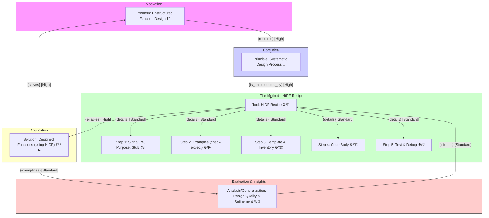
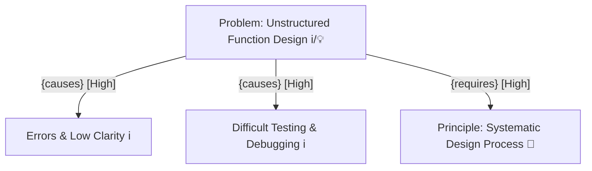
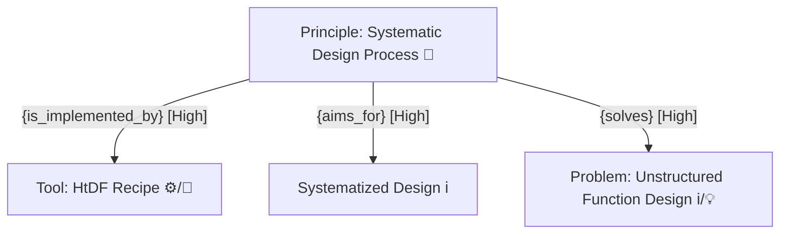
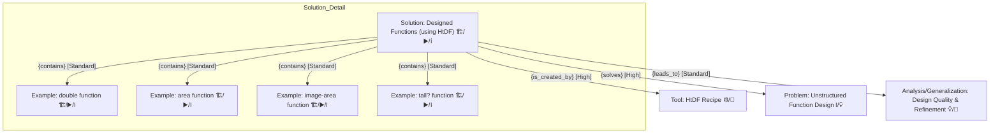
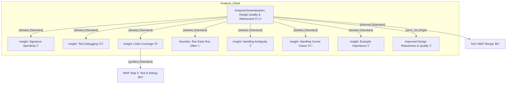

```mermaid
graph TD
    %% Phase 2 Parent Nodes (Simplified representation)
    C1["HtDF Step 1: Sig, Purp, Stub ⚙️/ℹ️"]
    C2["HtDF Step 2: Examples ⚙️/▶️"]
    C3["HtDF Step 3: Template ⚙️/🏗️"]
    C4["HtDF Step 4: Code Body ⚙️/🏗️"]
    C5["HtDF Step 5: Test & Debug ⚙️/💡"]
    E1["Insight: Signature Specificity 💡"]
    E3["Insight: Code Coverage 💡/ℹ️"]
    E6["Insight: Handling Corner Cases 💡/🎲"]

    %% Phase 3 Details & Examples linked to Parents
    C1 -->|"{details} [Standard]"| C1_D1["Signature Format: Inputs -> Output ℹ️"]
    C1_D1 -->|"{details} [Standard]"| C1_D1_D1["Primitive Types List ℹ️"]
    C1 -->|"{details} [Standard]"| C1_D2["Purpose Criteria: Describe output relation to input ℹ️"]
    C1_D2 -->|"{exemplifies} [Standard]"| C1_D2_E1["'produces n times 2' ℹ️"]
    C1 -->|"{details} [Standard]"| C1_D3["Stub Criteria: Name, Params, Dummy Result ℹ️"]
    C1_D3 -->|"{aims_for} [Standard]"| C1_D3_P1["Enable Early Example Runs 💡"]
    C1_D3 -->|"{exemplifies} [Standard]"| C1_D3_E1["Stub Example: (define (double n) 0) ▶️"]

    C2 -->|"{uses} [Standard]"| C2_T1["Tool: check-expect ⚙️"]
    C2_T1 -->|"{aims_for} [Standard]"| C2_T1_P1["Unit Testing 💡"]
    C2_T1 -->|"{exemplifies} [Standard]"| C2_T1_E1["Example: (check-expect (double 3) 6) ▶️"]
    C2 -->|"{aims_for} [Standard]"| C2_P1["Illustrate Detailed Behavior 💡"]
    C2 -->|"{aims_for} [Standard]"| C2_P2["Cover Input Variations 💡"]

    C3 -->|"{details} [Standard]"| C3_D1["Template Purpose: Show Available Inputs ℹ️"]
    C3_D1 -->|"{uses} [Standard]"| C3_D1_N1["Notation: (...) ℹ️"]
    C3_D1 -->|"{exemplifies} [Standard]"| C3_D1_E1["Template Example: (define (double n) (... n)) 🏗️"]

    C4 -->|"{details} [Standard]"| C4_D1["Action: Fill Template (...) ⚙️"]
    C4_D1 -->|"{requires} [Standard]"| C4_D1_R1["Input: Sig, Purp, Examples Info ℹ️"]
    C4_D1 -->|"{exemplifies} [Standard]"| C4_D1_E1["Body Example: (* 2 n) ▶️"]

    C5 -->|"{details} [Standard]"| C5_D1["Concept: Test Failure Causes ℹ️"]
    C5_D1 -->|"{details} [Standard]"| C5_D1_D1["Cause: Function Definition Wrong ℹ️"]
    C5_D1 -->|"{details} [Standard]"| C5_D1_D2["Cause: Test Example Wrong ℹ️"]
    C5_D1 -->|"{details} [Standard]"| C5_D1_D3["Cause: Both Wrong ℹ️"]
    C5 -->|"{details} [Standard]"| C5_D2["Debugging Strategy: Check Test First 🎲"]

    E1 -->|"{supports} [High]"| E1_R1["Rule: Use Most Specific Type 🎲"]
    E1_R1 -->|"{exemplifies} [Standard]"| E1_R1_E1["Example: Image -> Natural vs Number ℹ️"]

    E3 -->|"{details} [Standard]"| E3_D1["Definition: % Code Evaluated by Tests ℹ️"]
    E3 -->|"{implies} [High]"| E3_I1["Risk: Unevaluated Code May Be Wrong 💡"]
    E3 -->|"{requires} [Standard]"| E3_R1["Requirement: Test All Branches/Conditions 💡"]

    E6 -->|"{details} [Standard]"| E6_S1["Strategy: Write Test First 🎲"]
    E6_S1 -->|"{followed_by} [Standard]"| E6_S1_A1["Action: Update Design Parts ⚙️"]
    E6 -->|"{exemplifies} [Standard]"| E6_E1["Example: tall? H=W case ℹ️"]
```

```mermaid
graph TD
    %% Phase 2/3 Parent Nodes (Relevant for context)
    E["Analysis/Generalization: Design Quality & Refinement 💡/🎲/ℹ️"]
    E1["Insight: Signature Specificity 💡"]
    E2["Insight: Test Debugging 💡/🎲"]
    E3["Insight: Code Coverage 💡/ℹ️"]
    E6["Insight: Handling Corner Cases 💡/🎲"]
    E7["Insight: Example Importance 💡"]
    C["Tool: HtDF Recipe ⚙️/📖"] 
    %% For context of Run Early/Often

    %% Phase 4 Extracted Heuristics & Key Concepts
    H1["Extracted Heuristic: Run Early Run Often 🎲"]
    H2["Extracted Heuristic: Check Test First (Debugging) 🎲"]
    H3["Extracted Heuristic: Use Most Specific Type (Signatures) 🎲"]
    H4["Extracted Heuristic: Write Test First (Corner Cases) 🎲"]
    H5["Extracted Heuristic: Example Importance (Time Saved) 🎲"]

    G1["Generalization: HtDF pattern applicability 🌐"] 
    %% Representing generalization concept
    E_E1["Improved Design Robustness & Quality 💡"] 
    %% Goal of Analysis

    %% Linking Phase 4 elements
    E -->|"{yields} [Standard]"| H1;
    C -->|"{is_supported_by} [Standard]"| H1; 
    %% Already linked in Phase 3 map, re-shown for context

    E -->|"{yields} [Standard]"| H2;
    E2 -->|"{details} [Standard]"| H2; 
    %% Heuristic is the core of this insight

    E -->|"{yields} [Standard]"| H3;
    E1 -->|"{supports} [High]"| H3; 
    %% Heuristic is the core of this insight

    E -->|"{yields} [Standard]"| H4;
    E6 -->|"{details} [Standard]"| H4; 
    %% Heuristic is the core strategy

    E -->|"{yields} [Standard]"| H5;
    E7 -->|"{supports} [Standard]"| H5; 
    %% Heuristic captures the essence

    E -->|"{leads_to} [Standard]"| G1; 
    %% Analysis enables generalization
    E -->|"{aims_for} [High]"| E_E1; 
    %% Re-iterating the goal connection
```

---
{"dg-publish":true,"permalink":"/20-work-spaces/computer-science/programming/scheme/htdp/detailed/ht-dp-lec2/2-encoding/"}
---

up:: 
tags:: 

# 2. Encoding
## Phase 1: Get the Big Picture (Logic Level)

**Finalized Tags:** `tags:: #FunctionDesign, #SystematicProcess, #HtDFRecipe, #Testing, #ProblemSolving, #ProgrammingFundamentals`

**Core Problem, Principle, Solution Idea Confirmation:**

- **Problem:** Designing functions ad-hoc often leads to errors, unclear code, and difficulty in testing. The lack of a systematic approach makes function design less reliable and harder to manage.   
    
- **Principle:** A **systematic, step-by-step process** can significantly improve the quality, clarity, and testability of function designs. Following a defined recipe helps anticipate issues and structure the design process logically.   
    
- **Solution Idea:** Implement the **How to Design Functions (HtDF) Recipe**, a specific 5-step process, to guide function creation from initial definition to testing.   
    

**Core Nodes & Preliminary KT Tagging (GRINDE 'N') & Justification:**

1. **Problem: Unstructured Function Design** (❓/ℹ️) - Represents the motivating issue and its characteristics (lack of clarity, potential for errors).   
    
2. **Principle: Systematic Design Process** (📖) - Represents the core concept or philosophy proposed to address the problem (using a structured approach).   
    
3. **Tool: HtDF Recipe** (⚙️/📖) - Represents the specific method/tool embodying the principle. It's both a concept (📖) and a defined process (⚙️).   
    
4. **HtDF Steps (Sub-Nodes of Tool):**
    - Step 1: Signature, Purpose, Stub (⚙️/ℹ️) - Procedural step involving defining key declarative information.   
        
    - Step 2: Examples (check-expect) (⚙️/▶️) - Procedural step involving creating concrete instances/tests.   
        
    - Step 3: Template & Inventory (⚙️/🏗️) - Procedural step involving structuring the code based on inputs.   
        
    - Step 4: Code Body (⚙️/🏗️) - Procedural step involving implementation.   
        
    - Step 5: Test & Debug (⚙️/💡) - Procedural step involving evaluation and refinement.   
        
5. **Solution: Designed Functions (using HtDF)** (🏗️/▶️) - Represents the output or application of the recipe – the actual functions designed following the process. Examples provided: `double`, `area`, `image-area`, `tall?`.   
    
6. **Analysis/Generalization: Design Quality & Refinement** (💡/🎲) - Represents the evaluation, debugging insights, and best practices derived from applying the recipe. Includes concepts like signature specificity, handling test failures, addressing ambiguous problems, code coverage, and general heuristics ("Run Early Run Often" ).   
    

**Initial Groupings (GRINDE 'G') Reflecting Narrative:**

- **(Group 1) Motivation:** Problem: Unstructured Function Design
- **(Group 2) Core Idea:** Principle: Systematic Design Process
- **(Group 3) The Method:** Tool: HtDF Recipe (with HtDF Steps as sub-nodes)
- **(Group 4) Application:** Solution: Designed Functions (using HtDF) (Potentially group examples under this)
- **(Group 5) Evaluation & Insights:** Analysis/Generalization: Design Quality & Refinement (Potentially group key points/heuristics under this)

**Obvious High-Level GRINDE 'R' Links (GRINDE 'D'):**

- `Problem: Unstructured Function Design` - {requires} [High] - `Principle: Systematic Design Process` (The problem motivates the need for the principle).   
    
- `Principle: Systematic Design Process` - {is_implemented_by} [High] - `Tool: HtDF Recipe` (The recipe is the specific implementation of the principle).   
    
- `Tool: HtDF Recipe` - {details} [Standard] - `HtDF Steps` (The steps elaborate the tool).   
    
- `Tool: HtDF Recipe` - {enables} [High] - `Solution: Designed Functions (using HtDF)` (Using the tool leads to the solution).   
    
- `Solution: Designed Functions (using HtDF)` - {solves} [High] - `Problem: Unstructured Function Design`(The functions designed using the recipe aim to solve the initial problem). (Implied by the purpose of HtDF).
- `Solution: Designed Functions (using HtDF)` - {exemplifies} [Standard] - `Analysis/Generalization: Design Quality & Refinement` (Applying the recipe and observing the outcomes leads to analysis and insights).   
    
- `Analysis/Generalization: Design Quality & Refinement` - {informs} [Standard] - `Tool: HtDF Recipe`(Insights feedback to refine the application or understanding of the recipe, e.g., importance of specific steps).

### MIND MAP

---
---

##  Phase 2: Understand Concepts & Relationships (Concepts Level)

Here, I will explore each core concept identified in Phase 1, refine its KT, and map its relationships using GRINDE,focusing on the **Problem-Principle-Solution narrative**.

### 1. Concept: Problem: Unstructured Function Design

- **Explanation:** The core issue the document addresses is that designing functions without a clear, systematic approach (ad-hoc) often leads to code that is difficult to understand, debug, test, and maintain. This represents the motivation for adopting a structured method.
- **KT Refinement:** Primarily **Declarative (ℹ️)** - describing the state/problem, but also touches on **Conditional (💡)**aspects (e.g., _if_ design is unstructured, _then_ errors are likely). Confirmed as **ℹ️/💡**.
- **Targeted GRINDE Inquiry & Mapping:**
    - **WHY is this a Problem? (Justification)**
        - **Q:** What are the negative _consequences_ of unstructured design? (Leads to: `Cause/Effect`)
        - **A:** It can lead to errors, unclear code, difficulty testing, and compounding mistakes.
        - **Map:** `Problem: Unstructured Function Design` - {causes} [High] - `Errors & Low Clarity ℹ️`
        - **Map:** `Problem: Unstructured Function Design` - {causes} [High] - `Difficult Testing & Debugging ℹ️`
    - **WHAT does it require? (Need for Solution)**
        - **Q:** What is _needed_ to overcome this problem? (Leads to: `Dependency/Requirement`)
        - **A:** A systematic process is needed.
        - **Map:** `Problem: Unstructured Function Design` - {requires} [High] - `Principle: Systematic Design Process 📖`

#### MIND MAP

### 2. Concept: Principle: Systematic Design Process

- **Explanation:** The core idea proposed is that adopting a formalized, step-by-step methodology (a "recipe") for designing functions makes the process more manageable, predictable, and less prone to errors compared to unstructured approaches. This principle guides the entire HtDF framework.
- **KT Refinement:** Confirmed as **Declarative (📖)** - it's a foundational concept or principle.
- **Targeted GRINDE Inquiry & Mapping:**
    - **HOW is this Principle implemented? (Embodiment)**
        - **Q:** What specific _method or tool_ embodies this principle? (Leads to: `is_implemented_by`, a specific form of `Dependency/Requirement` or `Resource/Tool`)
        - **A:** The HtDF Recipe.
        - **Map:** `Principle: Systematic Design Process 📖` - {is_implemented_by} [High] - `Tool: HtDF Recipe ⚙️/📖` (Confirming Phase 1 link)
    - **WHY is this Principle beneficial? (Justification)**
        - **Q:** What is the _purpose_ or intended _effect_ of applying this principle? (Leads to: `Purpose/Goal`,`Cause/Effect`)
        - **A:** To systematize design, improve clarity, reduce errors, and enable easier testing (implied by solving the problem).
        - **Map:** `Principle: Systematic Design Process 📖` - {aims_for} [High] - `Systematized Design ℹ️`
        - **Map:** `Principle: Systematic Design Process 📖` - {solves} [High] - `Problem: Unstructured Function Design ℹ️/💡` (Inverse of the requires link)

#### MIND MAP

### 3. Concept: Tool: HtDF Recipe

- **Layman's Terms:** The HtDF Recipe is like a detailed checklist or cookbook guide for writing functions. Instead of just starting to code, you follow specific steps in order: figure out inputs/outputs, write down what the function should do, create examples, build a basic structure, write the code, and test it.
  
- **Explanation:** This is the concrete 5-step process presented as the tool to implement the systematic design principle. It breaks down function design into manageable, sequential (though potentially iterative ) stages.   
    
- **KT Refinement:** Confirmed as **Procedural (⚙️)** (the steps themselves) and **Declarative (📖)** (the concept of the recipe).
- **Targeted GRINDE Inquiry & Mapping:**
    - **WHAT are its parts/steps? (Structure)**
        - **Q:** What specific _steps_ compose the recipe? (Leads to: `details` or `contains`)
        - **A:** Step 1 (Sig, Purp, Stub), Step 2 (Examples), Step 3 (Template), Step 4 (Body), Step 5 (Test).   
            
        - **Map:** `Tool: HtDF Recipe ⚙️/📖` - {details} [Standard] - `HtDF Step 1: Sig, Purp, Stub ⚙️/ℹ️`
        - **Map:** `Tool: HtDF Recipe ⚙️/📖` - {details} [Standard] - `HtDF Step 2: Examples ⚙️/▶️`
        - **Map:** `Tool: HtDF Recipe ⚙️/📖` - {details} [Standard] - `HtDF Step 3: Template ⚙️/🏗️`
        - **Map:** `Tool: HtDF Recipe ⚙️/📖` - {details} [Standard] - `HtDF Step 4: Code Body ⚙️/🏗️`
        - **Map:** `Tool: HtDF Recipe ⚙️/📖` - {details} [Standard] - `HtDF Step 5: Test & Debug ⚙️/💡`
          
    - **HOW does it relate to the principle/problem? (Function)**
        - **Q:** How does the recipe _implement_ the systematic principle? (Leads to: `implements`, inverse of `is_implemented_by`)
        - **Map:** `Tool: HtDF Recipe ⚙️/📖` - {implements} [High] - `Principle: Systematic Design Process 📖`
        - **Q:** How does using the recipe _address_ the problem? (Leads to: `solves`)
        - **Map:** `Tool: HtDF Recipe ⚙️/📖` - {solves} [High] - `Problem: Unstructured Function Design ℹ️/💡` (By providing structure)
          
    - **WHEN/WHY use it (or its parts)? (Context/Rationale)**
        - **Q:** What is the _purpose_ of following these steps? (Leads to: `Purpose/Goal`)
        - **A:** To systematically design functions, ensuring all aspects (inputs, outputs, purpose, examples, implementation, testing) are considered.   
            
        - **Map:** `Tool: HtDF Recipe ⚙️/📖` - {aims_for} [High] - `Comprehensive Function Design ℹ️`
        - **Q:** Are there _conditions_ or _heuristics_ guiding its use? (Leads to: `Conditional`, `supports` for heuristics)
        - **A:** It's iterative (not rigid waterfall), allows going back to update previous steps, and benefits from "Run Early Run Often" heuristic.   
            
        - **Map:** `Tool: HtDF Recipe ⚙️/📖` - {is_applied_via} [Standard] - `Iterative Refinement 💡`
          
        - **Map:** `Tool: HtDF Recipe ⚙️/📖` - {is_supported_by} [Standard] - `Heuristic: Run Early Run Often 🎲`

#### MIND MAP

```mermaid
graph TD
    C["Tool: HtDF Recipe ⚙️/📖"] -->|"{details} [Standard]"| C1["HtDF Step 1: Sig, Purp, Stub ⚙️/ℹ️"];
    C -->|"{details} [Standard]"| C2["HtDF Step 2: Examples ⚙️/▶️"];
    C -->|"{details} [Standard]"| C3["HtDF Step 3: Template ⚙️/🏗️"];
    C -->|"{details} [Standard]"| C4["HtDF Step 4: Code Body ⚙️/🏗️"];
    C -->|"{details} [Standard]"| C5["HtDF Step 5: Test & Debug ⚙️/💡"];

    C -->|"{implements} [High]"| B["Principle: Systematic Design Process 📖"];
    C -->|"{solves} [High]"| A["Problem: Unstructured Function Design ℹ️/💡"];
    C -->|"{aims_for} [High]"| F["Comprehensive Function Design ℹ️"];
    C -->|"{is_applied_via} [Standard]"| G["Iterative Refinement 💡"];
    C -->|"{is_supported_by} [Standard]"| H["Heuristic: Run Early Run Often 🎲"];

    subgraph HtDF_Recipe_Detail
        C
        C1
        C2
        C3
        C4
        C5
        F
        G
        H
    end
```

### 4. Concept: Solution: Designed Functions (using HtDF)

- **Explanation:** These are the concrete outputs resulting from applying the HtDF recipe. The document provides several examples (`double`, `area`, `image-area`, `tall?`) to illustrate how the recipe leads to a complete function design, including tests.   
    
- **KT Refinement:** Primarily **Procedural (▶️)** (the running function/examples) and **Constructional (🏗️)** (the designed code/structure). Also **Declarative (ℹ️)** (the specific function definitions themselves). Confirmed as **🏗️/▶️/ℹ️**.
- **Targeted GRINDE Inquiry & Mapping:**
    - **HOW are they created? (Process)**
        - **Q:** What _process_ or _tool_ is used to create these functions? (Leads to: `is_created_by`, inverse of `enables`)
        - **A:** The HtDF Recipe.   
            
        - **Map:** `Solution: Designed Functions (using HtDF) 🏗️/▶️/ℹ️` - {is_created_by} [High] - `Tool: HtDF Recipe ⚙️/📖`
          
    - **WHAT are specific examples? (Instantiation)**
        - **Q:** Can you provide _examples_ of functions designed this way? (Leads to: `exemplifies`, or `contains` if viewed as a collection)
        - **A:** `double`, `area`, `image-area`, `tall?`.   
            
        - **Map:** `Solution: Designed Functions (using HtDF) 🏗️/▶️/ℹ️` - {contains} [Standard] - `Example: double function 🏗️/▶️/ℹ️`
        - **Map:** `Solution: Designed Functions (using HtDF) 🏗️/▶️/ℹ️` - {contains} [Standard] - `Example: area function 🏗️/▶️/ℹ️`
        - _(...and so on for other examples)_
          
    - **WHY are they significant? (Relation to Problem/Analysis)**
        - **Q:** How do these designed functions _address_ the initial problem? (Leads to: `solves`)
        - **A:** They represent functions created with clarity, structure, and testability, countering the issues of unstructured design (implied).
        - **Map:** `Solution: Designed Functions (using HtDF) 🏗️/▶️/ℹ️` - {solves} [High] - `Problem: Unstructured Function Design ℹ️/💡` (Confirming Phase 1 link)
        - **Q:** What _insights_ or _analysis points_ arise from designing these specific functions? (Leads to: `leads_to`or `exemplifies` for analysis)
        - **A:** Designing them reveals issues like test debugging, signature specificity, handling ambiguity, code coverage.   
            
        - **Map:** `Solution: Designed Functions (using HtDF) 🏗️/▶️/ℹ️` - {leads_to} [Standard] - `Analysis/Generalization: Design Quality & Refinement 💡/🎲`

#### MIND MAP

### 5. Concept: Analysis/Generalization: Design Quality & Refinement

- **Explanation:** This represents the higher-level understanding and practical wisdom gained from applying the HtDF recipe. It includes identifying common issues (like incorrect tests, wrong signatures, ambiguous requirements, incomplete tests ), and extracting general principles or heuristics (like signature specificity, the importance of examples, checking tests first, ensuring code coverage, and handling corner cases ).   
    
- **KT Refinement:** Primarily **Conditional (💡)** (understanding _why_ certain issues arise and _when_ to apply specific checks or refinements) and **Heuristic (🎲)** (extracting practical rules of thumb). Also **Declarative (ℹ️)** (definitions like code coverage). Confirmed as **💡/🎲/ℹ️**.
- **Targeted GRINDE Inquiry & Mapping:**
    - **WHAT insights are gained? (Content/Details)**
        - **Q:** What specific _lessons_ or _key points_ are derived from the examples? (Leads to: `details` or `contains`)
        - **A:** Signature Specificity, Test Debugging Strategy, Handling Ambiguity, Code Coverage Importance, Handling Corner Cases, Run Early Run Often, Example Importance.   
            
        - **Map:** `Analysis/Generalization: Design Quality & Refinement 💡/🎲/ℹ️` - {details} [Standard] - `Insight: Signature Specificity 💡`
        - **Map:** `Analysis/Generalization: Design Quality & Refinement 💡/🎲/ℹ️` - {details} [Standard] - `Insight: Test Debugging 💡/🎲`
        - **Map:** `Analysis/Generalization: Design Quality & Refinement 💡/🎲/ℹ️` - {details} [Standard] - `Insight: Code Coverage 💡/ℹ️`
        - **Map:** `Analysis/Generalization: Design Quality & Refinement 💡/🎲/ℹ️` - {details} [Standard] - `Heuristic: Run Early Run Often 🎲`
        - _(...and so on for other insights/heuristics)_
    - **HOW do these insights relate back to the process? (Feedback)**
        - **Q:** How do these insights _inform_ or _refine_ the use of the HtDF recipe? (Leads to: `informs`, `refines`, `guides`)
        - **A:** They emphasize the importance of specific steps (e.g., careful example design, testing) and provide strategies for handling issues encountered during the process.
        - **Map:** `Analysis/Generalization: Design Quality & Refinement 💡/🎲/ℹ️` - {informs} [Standard] - `Tool: HtDF Recipe ⚙️/📖` (Confirming Phase 1 link)
        - **Example Sub-link:** `Insight: Code Coverage 💡/ℹ️` - {guides} [Standard] - `HtDF Step 5: Test & Debug ⚙️/💡` (Guides how testing should be done)
          
    - **WHY are these insights important? (Impact)**
        - **Q:** What is the _purpose_ of understanding these points? (Leads to: `Purpose/Goal`)
        - **A:** To improve the quality and robustness of function design, avoid common pitfalls, and apply the HtDF recipe more effectively.
        - **Map:** `Analysis/Generalization: Design Quality & Refinement 💡/🎲/ℹ️` - {aims_for} [High] - `Improved Design Robustness & Quality 💡`

#### MIND MAP

--- 

## Phase 3: Add Key Details & Examples (Implementation Level)

Extracting key details and examples to ground the concepts from Phase 2.

**Details for `HtDF Step 1: Sig, Purp, Stub ⚙️/ℹ️`**

- **Q:** What are the _details_ of a Signature?
    - **A:** Consumes types -> Produces type. Example format: `Type ... -> Type`. Primitive types listed: Number, Integer, Natural, String, Image, Boolean.   
        
    - **Map:** `HtDF Step 1: Sig, Purp, Stub ⚙️/ℹ️` - {details} [Standard] - `Signature Format: Inputs -> Output ℹ️`
    - `Signature Format: Inputs -> Output ℹ️` - {details} [Standard] - `Primitive Types List ℹ️`
      
- **Q:** What are the _details/criteria_ for a Purpose statement?
    - **A:** Literal description: produces Y in terms of X. Must say more than the signature. Example: "produces n times 2".   
        
    - **Map:** `HtDF Step 1: Sig, Purp, Stub ⚙️/ℹ️` - {details} [Standard] - `Purpose Criteria: Describe output relation to input ℹ️`
    - `Purpose Criteria: Describe output relation to input ℹ️` - {exemplifies} [Standard] - `"produces n times 2" ℹ️`
      
- **Q:** What are the _details/criteria_ for a Stub?
    - **A:** Correct name, correct parameter count, dummy result of correct type. Purpose: scaffolding for running examples early. Example: `(define (double n) 0)`.   
        
    - **Map:** `HtDF Step 1: Sig, Purp, Stub ⚙️/ℹ️` - {details} [Standard] - `Stub Criteria: Name, Params, Dummy Result ℹ️`
      
    - `Stub Criteria: Name, Params, Dummy Result ℹ️` - {aims_for} [Standard] - `Enable Early Example Runs 💡`
      
    - `Stub Criteria: Name, Params, Dummy Result ℹ️` - {exemplifies} [Standard] - `Stub Example: (define (double n) 0) ▶️`

**Details for `HtDF Step 2: Examples ⚙️/▶️`**

- **Q:** What is the _format/tool_ used for examples?
    - **A:** Wrap in `check-expect`. Purpose: serve as unit tests. Example: `(check-expect (double 3) 6)`.   
        
    - **Map:** `HtDF Step 2: Examples ⚙️/▶️` - {uses} [Standard] - `Tool: check-expect ⚙️`
      
    - `Tool: check-expect ⚙️` - {aims_for} [Standard] - `Unit Testing 💡`
      
    - `Tool: check-expect ⚙️` - {exemplifies} [Standard] - `Example: (check-expect (double 3) 6) ▶️`
      
- **Q:** _Why_ are multiple examples good?
    - **A:** Illustrate detailed behavior, time spent here saves implementation time. Cover different input types/ranges (e.g., integer vs float).   
        
    - **Map:** `HtDF Step 2: Examples ⚙️/▶️` - {aims_for} [Standard] - `Illustrate Detailed Behavior 💡`
    - **Map:** `HtDF Step 2: Examples ⚙️/▶️` - {aims_for} [Standard] - `Cover Input Variations 💡`

**Details for `HtDF Step 3: Template ⚙️/🏗️`**

- **Q:** What does a template _show_? What is its _format_?
    - **A:** Shows available inputs/parameters to work with. Uses `(...)` notation. Example: `(define (double n) (... n))`. Don't have to use all inputs.   
        
    - **Map:** `HtDF Step 3: Template ⚙️/🏗️` - {details} [Standard] - `Template Purpose: Show Available Inputs ℹ️`
      
    - `Template Purpose: Show Available Inputs ℹ️` - {uses} [Standard] - `Notation: (...) ℹ️`
      
    - `Template Purpose: Show Available Inputs ℹ️` - {exemplifies} [Standard] - `Template Example: (define (double n) (... n)) 🏗️`

**Details for `HtDF Step 4: Code Body ⚙️/🏗️`**

- **Q:** _How_ is the body coded?
    - **A:** Fill in the `(...)` from the template. Use information from signature, purpose, examples. Example: `(define (double n) (* 2 n))`.   
        
    - **Map:** `HtDF Step 4: Code Body ⚙️/🏗️` - {details} [Standard] - `Action: Fill Template (...) ⚙️`
      
    - `Action: Fill Template (...) ⚙️` - {requires} [Standard] - `Input: Sig, Purp, Examples Info ℹ️`
      
    - `Action: Fill Template (...) ⚙️` - {exemplifies} [Standard] - `Body Example: (* 2 n) ▶️`

**Details for `HtDF Step 5: Test & Debug ⚙️/💡`**

- **Q:** What are _causes_ of test failure? _How_ to debug?
    - **A:** Test failure (`check-expect` fails) can mean: function definition wrong, test wrong, or both wrong. Strategy: check the test first before fixing the function.   
        
    - **Map:** `HtDF Step 5: Test & Debug ⚙️/💡` - {details} [Standard] - `Concept: Test Failure Causes ℹ️`
    - `Concept: Test Failure Causes ℹ️` - {details} [Standard] - `Cause: Function Definition Wrong ℹ️`
    - `Concept: Test Failure Causes ℹ️` - {details} [Standard] - `Cause: Test Example Wrong ℹ️`
    - `Concept: Test Failure Causes ℹ️` - {details} [Standard] - `Cause: Both Wrong ℹ️`
    - `HtDF Step 5: Test & Debug ⚙️/💡` - {details} [Standard] - `Debugging Strategy: Check Test First 🎲`

**Details for `Insight: Signature Specificity 💡`**

- **Q:** _Why_ specific? _Example_?
    - **A:** Signatures should be as specific as possible. Example: `Image -> Natural` is better than `Image -> Number`because image dimensions are natural numbers.   
        
    - **Map:** `Insight: Signature Specificity 💡` - {supports} [High] - `Rule: Use Most Specific Type 🎲`
    - `Rule: Use Most Specific Type 🎲` - {exemplifies} [Standard] - `Example: Image -> Natural vs Number ℹ️`

**Details for `Insight: Code Coverage 💡/ℹ️`**

- **Q:** _What_ is it? _Why_ important?
    - **A:** Definition: How much code is evaluated by tests. Importance: Unevaluated code might be wrong. Needs tests for all branches/conditions (e.g., W>H, W<H, W=H).   
        
    - **Map:** `Insight: Code Coverage 💡/ℹ️` - {details} [Standard] - `Definition: % Code Evaluated by Tests ℹ️`
    - `Insight: Code Coverage 💡/ℹ️` - {implies} [High] - `Risk: Unevaluated Code May Be Wrong 💡`
    - `Insight: Code Coverage 💡/ℹ️` - {requires} [Standard] - `Requirement: Test All Branches/Conditions 💡`

**Details for `Insight: Handling Corner Cases 💡/🎲`**

- **Q:** _What_ to do when finding one?
    - **A:** Strategy: Write a test example immediately. Update affected design parts (purpose, definition, potentially signature). Example: Handling H=W case for `tall?` function.   
        
    - **Map:** `Insight: Handling Corner Cases 💡/🎲` - {details} [Standard] - `Strategy: Write Test First 🎲`
    - `Strategy: Write Test First 🎲` - {followed_by} [Standard] - `Action: Update Design Parts ⚙️`
    - `Insight: Handling Corner Cases 💡/🎲` - {exemplifies} [Standard] - `Example: tall? H=W case ℹ️`

#### MIND MAP

---
## Phase 4: Refine & Reflect (Mastery & Metacognition)

**Synthesize & Structure:**

- **Problem-Principle-Solution Flow Review:** The flow is clear: Unstructured design (Problem ❓/ℹ️) motivates a Systematic Process (Principle 📖), implemented by the HtDF Recipe (Tool ⚙️/📖). Applying the tool yields Designed Functions (Solution 🏗️/▶️), and analysis of this process yields critical Insights and Heuristics (Analysis/Generalization 💡/🎲). The structure holds together well.
- **KT Patterns:** A strong flow from defining the Problem/Principle (ℹ️/📖) to outlining the Tool/Process (⚙️), demonstrating Application/Solution (▶️/🏗️), and extracting conditional/heuristic Analysis (💡/🎲). This pattern (ℹ️/📖 -> ⚙️ -> ▶️/🏗️ -> 💡/🎲) seems characteristic of process-oriented learning materials.
- **Core vs. Operational:** The core links are the Problem -> Principle -> Tool -> Solution -> Analysis connections. The operational details lie within the specific HtDF steps and the nuances of applying them (e.g., specific syntax, template filling rules). The Analysis insights (Specificity, Coverage, Debugging) bridge the operational back to refining the core understanding of the Tool/Principle.
- **Generalization:** The HtDF recipe itself is a generalization of a systematic design approach applicable beyond just primitive data, though the document focuses there. The principle of breaking down design into signature, purpose, examples, structure, code, and testing is broadly applicable (🌐).
- **Finalize Tags:** Reviewing the map confirms the relevance of the current tags. Add `#Debugging` and `#CodeQuality`as they are strong themes in the analysis section. `tags:: #FunctionDesign, #SystematicProcess, #HtDFRecipe, #Testing, #ProblemSolving, #ProgrammingFundamentals, #Debugging, #CodeQuality`

**Critically Evaluate:**

- **Effectiveness of Principle/Solution:** The HtDF recipe (Solution/Tool) appears highly effective for the stated Problem (unstructured design for functions on primitives). It directly addresses clarity, testability, and structured thinking. Its step-by-step nature provides strong scaffolding.
- **Elegance/Efficiency/Robustness:** The recipe promotes robust designs through integrated testing (`check-expect`) and focus on edge cases/coverage. Its elegance lies in its simplicity and systematic nature. Efficiency-wise, while it adds upfront design time, it likely saves time overall by reducing debugging effort.   
    
- **Heuristics Critique:**
    - `Run Early Run Often` (🎲): Solid advice, promotes incremental development and quick feedback, reducing complex debugging later. Universally applicable in coding.   
        
    - `Check Test First` (🎲): Good debugging heuristic. Saves time by not fixing code if the test expectation is wrong. Requires discipline.   
        
    - `Use Most Specific Type` (🎲): Strong guideline for clarity and catching errors early. Encourages precise thinking about data.   
        
    - `Write Test First (for Corner Cases)` (🎲): Excellent practice (akin to Test-Driven Development). Ensures corner cases aren't forgotten and forces clear definition of expected behavior.   
        
- **Nuanced Link Critique:**
    - `Tool: HtDF Recipe` - {enables} [High] - `Solution: Designed Functions`: This link is strong because the document explicitly shows the recipe _producing_ the example functions step-by-step. The recipe directly makes these structured designs possible.
    - `Analysis/Generalization` - {informs} [Standard] - `Tool: HtDF Recipe`: This link is crucial for mastery. Understanding why signatures should be specific or why coverage matters directly improves _how_ one applies the recipe steps. Its emphasis is standard because it's about refinement, not initial creation.

**Extract Heuristics (🎲):**

- Run Early Run Often (Test frequently during development).
- When debugging test failures, check the test example first before fixing the function code.
- Always use the most specific type possible in function signatures.
- When discovering a corner case or boundary condition, write a test case for it immediately.
- Time spent designing good examples is time gained during implementation.

**Prompt Reflection:**

- How well does the HtDF recipe address the potential ambiguities or complexities that might arise even when designing functions for simple, primitive data?
- Are the 5 steps of the HtDF Recipe always the best sequence? When might you deviate or reorder them based on the specific problem? (Relates to Conditional 💡).
- How does the HtDF principle of separating definition (Sig/Purp), examples, structure (Template), and implementation (Body) compare to other function design approaches you know? (Relates to Structural 🌐/Comparison).
- What are the limitations of focusing solely on primitive data, as in this document? How might the HtDF recipe need adaptation for more complex data structures? (Generalization 🌐).
- Which heuristic extracted (Run Early, Check Test, Specific Types, Test Corners) do you think provides the most significant benefit in improving code quality, and why?

#### MIND MAP

---
## 🔑 Key Points
- 
## ❓ Questions
- 
## 📦 Resources
- 
## 🎯 Actions
- [ ] 
- [ ] 
- [ ] 
- [ ] 
- [ ] 