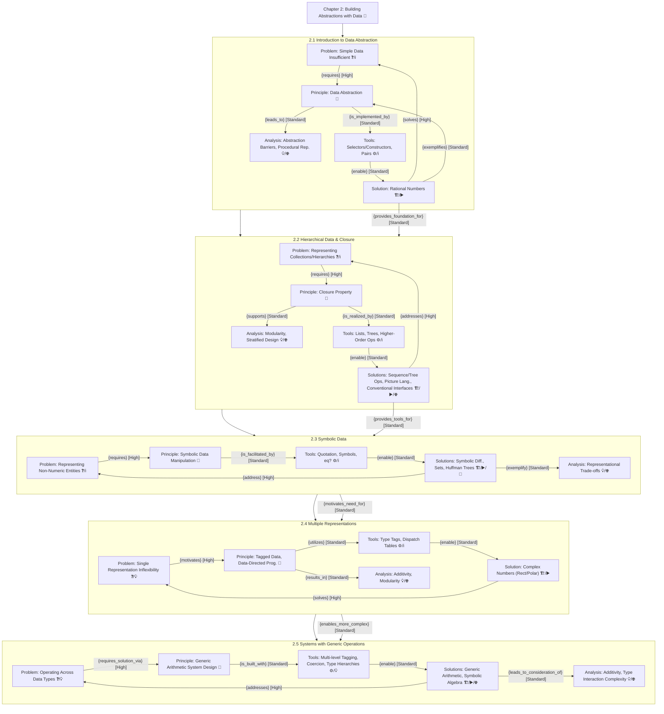

---
{"dg-publish":true,"permalink":"/20-work-spaces/computer-science/programming/scheme/sicp/detailed/chapter-ii/grinde/1-big-picture/","tags":["gardenEntry"]}
---

up:: 
tags:: #DataAbstraction, #CompoundData, #SystemDesign, #Modularity, #ProceduralAbstraction, #HigherOrderFunctions, #ComputationalProcesses, #SoftwareDesignPrinciples

# 1. Phase I - Big Picture (Logic Level)

## 1. Confirm Core Topic & Intent (Link to Primer):

- **Core Topic (ℹ️):** Building Abstractions with Data.
- **Relevance (🔑):** Essential for designing robust, maintainable, and flexible software by managing complexity in data representation and manipulation.
- **Learning Intention (🎯):**
    - To explain the **Principle (📖)** of data abstraction and how it helps address the **Problem (❓)** of managing complexity when working with compound data.
    - To describe various **Tools (⚙️)** for constructing compound data and how they facilitate different **Solutions (🏗️)** for representing information, including their **Analysis (💡)** of trade-offs.

## 2. Survey & Initial Nodes, 
## 3. Preliminary KT Tagging (GRINDE 'N'), 
## 4. Initial Grouping (GRINDE 'G'), 
## 5. Map Obvious High-Level Structure (GRINDE 'R', 'D'):

The overall chapter aims to solve the **Problem: Managing Complexity in Data Representation and Manipulation (❓/💡)**. The overarching **Principle: Data Abstraction and Generic Operations (📖)** is applied through various **Tools (⚙️)** to build **Solutions: Modular and Extensible Data Systems (🏗️/🌐)**, with continuous **Analysis: Efficiency, Modularity, Design Trade-offs (💡)**.

Here's the breakdown by section:

### Group: 2.1 Introduction to Data Abstraction

- **Node 2.1.P:** 
	- Problem: Simple Data is Insufficient for Complex Phenomena (❓/ℹ️)
    - _Justification:_ This section explicitly states that simple numerical data (from Ch 1) is not enough for many problems, motivating the need for compound data.
- **Node 2.1.Pr:** 
	- Principle: Data Abstraction (Separating Use from Representation) (📖)
    - _Justification:_ Data abstraction is introduced as the core methodological principle to manage compound data.
- **Node 2.1.T:** 
	- Tools: Selectors, Constructors, Pairs (`cons`, `car`, `cdr`) (⚙️/ℹ️)
    - _Justification:_ These are the mechanisms provided by the language and defined by the abstraction designer to implement the principle.
- **Node 2.1.S:** 
	- Solution: Rational Number Arithmetic System (🏗️/▶️)
    - _Justification:_ This is the primary example used to demonstrate the application of data abstraction using the defined tools.
- **Node 2.1.A:** 
	- Analysis: Abstraction Barriers, Defining Data by Operations (💡/🌐)
    - _Justification:_ Discusses the benefits (modularity, maintainability) and implications of this approach, including procedural representation of data.

**GRINDE Links for 2.1:**

- `[Node 2.1.P] - {requires} [High] - [Node 2.1.Pr]`
- `[Node 2.1.Pr] - {is_implemented_by} [Standard] - [Node 2.1.T]`
- `[Node 2.1.T] - {enable} [Standard] - [Node 2.1.S]`
- `[Node 2.1.S] - {solves} [High] - [Node 2.1.P]`
- `[Node 2.1.S] - {exemplifies} [Standard] - [Node 2.1.Pr]`
- `[Node 2.1.Pr] - {leads_to} [Standard] - [Node 2.1.A]`

### Group: 2.2 Hierarchical Data and the Closure Property

- **Node 2.2.P:** 
	- Problem: Representing Ordered Collections & Hierarchical Structures (❓/ℹ️)
    - _Justification:_ This section addresses the need to build more complex structures beyond simple pairs, like sequences and trees.
- **Node 2.2.Pr:** 
	- Principle: Closure Property of Data Constructors (📖)
    - _Justification:_ The closure property of `cons` is highlighted as key to building hierarchical structures.
- **Node 2.2.T:** 
	- Tools: Lists, Trees, Higher-Order Sequence Operations (`map`, `filter`, `accumulate`) (⚙️/ℹ️)
    - _Justification:_ These are the data structures and procedural tools developed based on the closure principle.
- **Node 2.2.S:** 
	- Solutions: Sequence/Tree Manipulations, Picture Language, Conventional Interfaces (🏗️/▶️/🌐)
    - _Justification:_ These are concrete applications and design patterns (like signal flow for conventional interfaces) enabled by the tools and principle.
- **Node 2.2.A:**
	- Analysis: Modularity via Conventional Interfaces, Stratified Design (💡/🌐)
    - _Justification:_ Discusses the design benefits, especially the power of conventional interfaces for modularity and stratified design illustrated by the picture language.

**GRINDE Links for 2.2:**

- `[Node 2.2.P] - {requires} [High] - [Node 2.2.Pr]`
- `[Node 2.2.Pr] - {is_realized_by} [Standard] - [Node 2.2.T]` (Using "is_realized_by" as a synonym for "is_implemented_by" or "is_manifested_through" for variety)
- `[Node 2.2.T] - {enable} [Standard] - [Node 2.2.S]`
- `[Node 2.2.S] - {addresses} [High] - [Node 2.2.P]` (Using "addresses" as a synonym for "solves")
- `[Node 2.2.Pr] - {supports} [Standard] - [Node 2.2.A]`

### Group: 2.3 Symbolic Data

- **Node 2.3.P:** 
	- Problem: Representing and Manipulating Non-Numeric, Symbolic Entities (❓/ℹ️)
    - _Justification:_ The chapter shifts to data whose elementary parts can be arbitrary symbols, not just numbers.
- **Node 2.3.Pr:** 
	- Principle: Symbolic Data Manipulation (Treating Symbols as Data) (📖)
    - _Justification:_ The ability to handle symbols directly as data is the core principle.
- **Node 2.3.T:** 
	- Tools: Quotation (`'`), Symbols, `eq?`, List-based Representations for Expressions/Sets (⚙️/ℹ️)
    - _Justification:_ These are the mechanisms needed to work with symbolic data.
- **Node 2.3.S:** 
	- Solutions: Symbolic Differentiation, Various Set Representations, Huffman Encoding Trees (🏗️/▶️/🎲)
    - _Justification:_ These are significant examples demonstrating symbolic data manipulation.
- **Node 2.3.A:** 
	- Analysis: Representational Trade-offs (e.g., for sets), Power of Symbolic Computation (💡/🌐)
    - _Justification:_ Discusses choices in representation (e.g., ordered vs. unordered lists vs. trees for sets) and their impact.

**GRINDE Links for 2.3:**

- `[Node 2.3.P] - {requires} [High] - [Node 2.3.Pr]`
- `[Node 2.3.Pr] - {is_facilitated_by} [Standard] - [Node 2.3.T]`
- `[Node 2.3.T] - {enable} [Standard] - [Node 2.3.S]`
- `[Node 2.3.S] - {address} [High] - [Node 2.3.P]`
- `[Node 2.3.S] - {exemplify} [Standard] - [Node 2.3.A]`

### Group: 2.4 Multiple Representations for Abstract Data

- **Node 2.4.P:** 
	- Problem: Inflexibility of Single Data Representation; Need for Coexistence (❓/💡)
    - _Justification:_ This section tackles the issue that a single representation isn't always optimal or feasible when combining different modules.
- **Node 2.4.Pr:** 
	- Principle: Generic Operations via Type Tags & Data-Directed Programming (📖)
    - _Justification:_ These are the core design principles introduced to allow procedures to operate on data with multiple representations.
- **Node 2.4.T:** 
	- Tools: Type Tags (`attach-tag`, `type-tag`, `contents`), Dispatch Tables (`put`/`get`), Message Passing (⚙️/ℹ️)
    - _Justification:_ These are the mechanisms used to implement the principles of tagged data and data-directed dispatch.
- **Node 2.4.S:** 
	- Solution: Complex Numbers with Coexisting Rectangular & Polar Representations (🏗️/▶️)
    - _Justification:_ This example illustrates how to build a system that accommodates multiple representations for the same abstract data type.
- **Node 2.4.A:** 
	- Analysis: Additivity of Systems, Modularity benefits (💡/🌐)
    - _Justification:_ Discusses how data-directed design promotes additivity, allowing new representations to be added without modifying existing generic code.

**GRINDE Links for 2.4:**

- `[Node 2.4.P] - {motivates} [High] - [Node 2.4.Pr]`
- `[Node 2.4.Pr] - {utilizes} [Standard] - [Node 2.4.T]`
- `[Node 2.4.T] - {enable} [Standard] - [Node 2.4.S]`
- `[Node 2.4.S] - {solves} [High] - [Node 2.4.P]`
- `[Node 2.4.Pr] - {results_in} [Standard] - [Node 2.4.A]`

### Group: 2.5 Systems with Generic Operations

- **Node 2.5.P:** 
	- Problem: Operating Across Different Data Types (e.g., adding a complex number to a rational) (❓/💡)
    - _Justification:_ Extends the previous problem to not just multiple representations of one type, but operations across fundamentally different types.
- **Node 2.5.Pr:** 
	- Principle: Generic Arithmetic System Design (📖)
    - _Justification:_ The goal is to build a unified system where operations like `add` work across various number types.
- **Node 2.5.T:** 
	- Tools: Multi-level Tagging, `apply-generic`, Coercion, Type Hierarchies (⚙️/💡)
    - _Justification:_ These are advanced mechanisms for managing interactions between different data type packages.
- **Node 2.5.S:** 
	- Solution: Generic Arithmetic Package (Scheme nums, Rationals, Complexes), Symbolic Algebra System (Polynomials, Rational Functions) (🏗️/▶️/🌐)
    - _Justification:_ These are the culminating examples, showing a sophisticated system built using all prior principles.
- **Node 2.5.A:** 
	- Analysis: Advantages of Additivity, Handling Type Interactions, Complexity of Coercion and Type Systems (💡/🌐)
    - _Justification:_ Discusses the power of this approach but also the inherent complexities in managing rich type systems.

**GRINDE Links for 2.5:**

- `[Node 2.5.P] - {requires_solution_via} [High] - [Node 2.5.Pr]`
- `[Node 2.5.Pr] - {is_built_with} [Standard] - [Node 2.5.T]`
- `[Node 2.5.T] - {enable} [Standard] - [Node 2.5.S]`
- `[Node 2.5.S] - {addresses} [High] - [Node 2.5.P]`
- `[Node 2.5.S] - {leads_to_consideration_of} [Standard] - [Node 2.5.A]`

**Overall Chapter Links:**

- `[Node 2.1.S] - {provides_foundation_for} [Standard] - [Node 2.2.P]` (Understanding basic data abstraction and pairs is needed for hierarchical data)
- `[Node 2.2.S] - {provides_tools_for} [Standard] - [Node 2.3.S]` (List/tree structures are used for symbolic data representations)
- `[Node 2.1.Pr, Node 2.2.Pr, Node 2.3.Pr] - {are_generalized_by} [High] - [Node 2.4.Pr]` (The need for generic operations arises from having different types/representations)
- `[Node 2.4.S] - {is_extended_by} [High] - [Node 2.5.S]` (Generic operations for one type (complex numbers) are broadened to generic operations across many types).

## 6. Finalize Initial Tags (Already done at the top)

## 7. Mind Map Requirement

---

## 🔑 Key Points
- 
## ❓ Questions
- 
## 📦 Resources
- 
## 🎯 Actions
- [ ] 
- [ ] 
- [ ] 
- [ ] 
- [ ] 